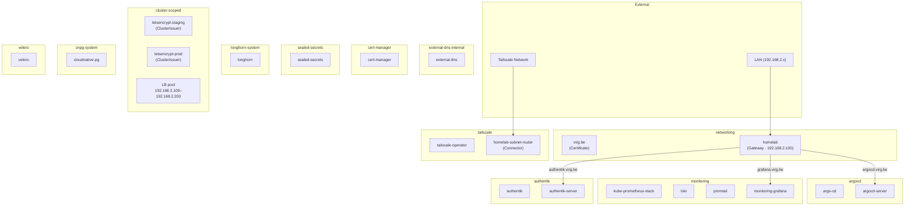

```mermaid
flowchart TD
    subgraph external["External"]
        lan["LAN (192.168.2.x)"]
        ts_net["Tailscale Network"]
    end
    subgraph networking__ns["networking"]
        networking__virg_be_wildcard["virg.be\n(Certificate)"]
        networking__homelab["homelab\n(Gateway · 192.168.2.100)"]
    end
    subgraph argocd__ns["argocd"]
        argocd__argo_cd["argo-cd"]
        argocd__argocd_server["argocd-server"]
    end
    subgraph external_dns_internal__ns["external‑dns‑internal"]
        external_dns_internal__external_dns["external-dns"]
    end
    subgraph cert_manager__ns["cert‑manager"]
        cert_manager__cert_manager["cert-manager"]
    end
    subgraph sealed_secrets__ns["sealed‑secrets"]
        sealed_secrets__sealed_secrets["sealed-secrets"]
    end
    subgraph tailscale__ns["tailscale"]
        tailscale__tailscale_operator["tailscale-operator"]
        tailscale__homelab_subnet_router["homelab-subnet-router\n(Connector)"]
    end
    subgraph longhorn_system__ns["longhorn‑system"]
        longhorn_system__longhorn["longhorn"]
    end
    subgraph monitoring__ns["monitoring"]
        monitoring__kube_prometheus_stack["kube-prometheus-stack"]
        monitoring__loki["loki"]
        monitoring__promtail["promtail"]
        monitoring__monitoring_grafana["monitoring-grafana"]
    end
    subgraph cluster_scoped__ns["cluster‑scoped"]
        cluster_scoped__letsencrypt_staging["letsencrypt-staging\n(ClusterIssuer)"]
        cluster_scoped__letsencrypt_prod["letsencrypt-prod\n(ClusterIssuer)"]
        cluster_scoped__homelab_pool["LB pool\n192.168.2.100–192.168.2.200"]
    end
    subgraph authentik__ns["authentik"]
        authentik__authentik["authentik"]
        authentik__authentik_server["authentik-server"]
    end
    subgraph cnpg_system__ns["cnpg‑system"]
        cnpg_system__cloudnative_pg["cloudnative-pg"]
    end
    subgraph velero__ns["velero"]
        velero__velero["velero"]
    end
    lan --> networking__homelab
    ts_net --> tailscale__homelab_subnet_router
    networking__homelab -->|"argocd.virg.be"| argocd__argocd_server
    networking__homelab -->|"authentik.virg.be"| authentik__authentik_server
    networking__homelab -->|"grafana.virg.be"| monitoring__monitoring_grafana
```
