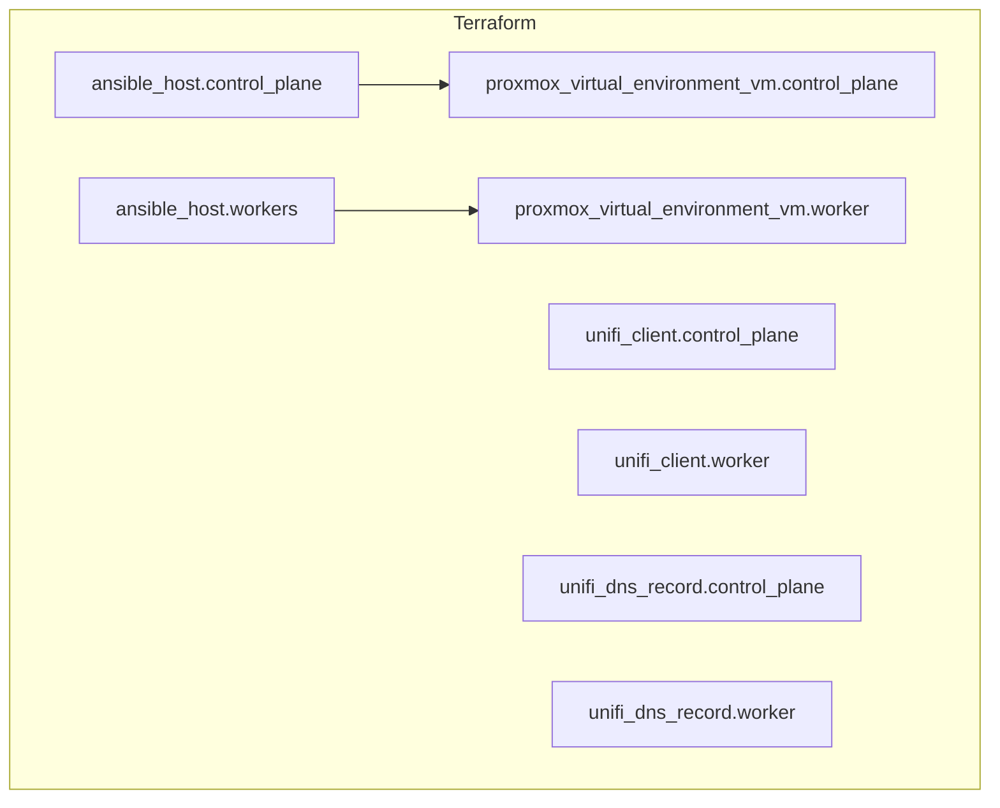

```mermaid
flowchart TD
    subgraph Terraform
        ansible_host_control_plane["ansible_host.control_plane"]
        ansible_host_workers["ansible_host.workers"]
        proxmox_virtual_environment_vm_control_plane["proxmox_virtual_environment_vm.control_plane"]
        proxmox_virtual_environment_vm_worker["proxmox_virtual_environment_vm.worker"]
        unifi_client_control_plane["unifi_client.control_plane"]
        unifi_client_worker["unifi_client.worker"]
        unifi_dns_record_control_plane["unifi_dns_record.control_plane"]
        unifi_dns_record_worker["unifi_dns_record.worker"]
    end
    ansible_host_control_plane --> proxmox_virtual_environment_vm_control_plane
    ansible_host_workers --> proxmox_virtual_environment_vm_worker
```
