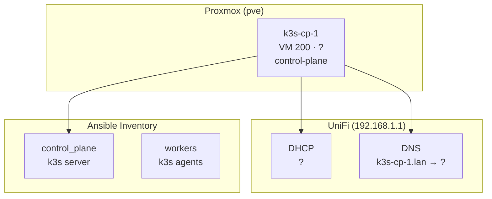

```mermaid
flowchart TD
    subgraph Proxmox["Proxmox (pve)"]
        vm_cp["k3s-cp-1\nVM 200 · ?\ncontrol-plane"]
    end
    subgraph UniFi["UniFi (192.168.1.1)"]
        dhcp_cp["DHCP\n?"]
        dns_cp["DNS\nk3s-cp-1.lan → ?"]
    end
    subgraph Ansible["Ansible Inventory"]
        ans_cp["control_plane\nk3s server"]
        ans_w["workers\nk3s agents"]
    end
    vm_cp --> dhcp_cp
    vm_cp --> dns_cp
    vm_cp --> ans_cp
```
