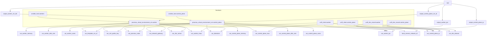

```mermaid
flowchart TD
    subgraph Terraform
        ansible_host_control_plane["ansible_host.control_plane"]
        ansible_host_workers["ansible_host.workers"]
        proxmox_virtual_environment_vm_control_plane["proxmox_virtual_environment_vm.control_plane"]
        proxmox_virtual_environment_vm_worker["proxmox_virtual_environment_vm.worker"]
        unifi_client_control_plane["unifi_client.control_plane"]
        unifi_client_worker["unifi_client.worker"]
        unifi_dns_record_control_plane["unifi_dns_record.control_plane"]
        unifi_dns_record_worker["unifi_dns_record.worker"]
    end
    ansible_host_control_plane --> proxmox_virtual_environment_vm_control_plane
    ansible_host_workers --> proxmox_virtual_environment_vm_worker
    output_control_plane_ip --> var_control_plane_ip
    output_control_plane_vm_id --> proxmox_virtual_environment_vm_control_plane
    output_worker_ips --> var_worker_ips
    output_worker_vm_ids --> proxmox_virtual_environment_vm_worker
    proxmox_virtual_environment_vm_control_plane --> var_control_plane_cores
    proxmox_virtual_environment_vm_control_plane --> var_control_plane_disk_size
    proxmox_virtual_environment_vm_control_plane --> var_control_plane_ip
    proxmox_virtual_environment_vm_control_plane --> var_control_plane_mac
    proxmox_virtual_environment_vm_control_plane --> var_control_plane_memory
    proxmox_virtual_environment_vm_control_plane --> var_datastore
    proxmox_virtual_environment_vm_control_plane --> var_dns_server
    proxmox_virtual_environment_vm_control_plane --> var_network_gateway
    proxmox_virtual_environment_vm_control_plane --> var_proxmox_node
    proxmox_virtual_environment_vm_control_plane --> var_ssh_public_key
    proxmox_virtual_environment_vm_control_plane --> var_template_vm_id
    proxmox_virtual_environment_vm_worker --> var_datastore
    proxmox_virtual_environment_vm_worker --> var_dns_server
    proxmox_virtual_environment_vm_worker --> var_network_gateway
    proxmox_virtual_environment_vm_worker --> var_proxmox_node
    proxmox_virtual_environment_vm_worker --> var_ssh_public_key
    proxmox_virtual_environment_vm_worker --> var_template_vm_id
    proxmox_virtual_environment_vm_worker --> var_worker_cores
    proxmox_virtual_environment_vm_worker --> var_worker_disk_size
    proxmox_virtual_environment_vm_worker --> var_worker_ips
    proxmox_virtual_environment_vm_worker --> var_worker_macs
    proxmox_virtual_environment_vm_worker --> var_worker_memory
    root --> output_control_plane_ip
    root --> output_control_plane_vm_id
    root --> output_worker_ips
    root --> output_worker_vm_ids
    unifi_client_control_plane --> local_servers_network_id
    unifi_client_control_plane --> var_control_plane_ip
    unifi_client_control_plane --> var_control_plane_mac
    unifi_client_worker --> local_servers_network_id
    unifi_client_worker --> var_worker_ips
    unifi_client_worker --> var_worker_macs
    unifi_dns_record_control_plane --> var_control_plane_ip
    unifi_dns_record_control_plane --> var_dns_domain
    unifi_dns_record_worker --> var_dns_domain
    unifi_dns_record_worker --> var_worker_ips
```
