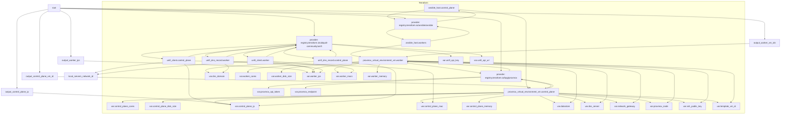

```mermaid
flowchart TD
    subgraph Terraform
        ansible_host_control_plane["ansible_host.control_plane"]
        ansible_host_workers["ansible_host.workers"]
        provider_registry_terraform_io_ansible_ansible["provider: registry.terraform.io/ansible/ansible"]
        provider_registry_terraform_io_bpg_proxmox["provider: registry.terraform.io/bpg/proxmox"]
        provider_registry_terraform_io_ubiquiti_community_unifi["provider: registry.terraform.io/ubiquiti-community/unifi"]
        proxmox_virtual_environment_vm_control_plane["proxmox_virtual_environment_vm.control_plane"]
        proxmox_virtual_environment_vm_worker["proxmox_virtual_environment_vm.worker"]
        unifi_client_control_plane["unifi_client.control_plane"]
        unifi_client_worker["unifi_client.worker"]
        unifi_dns_record_control_plane["unifi_dns_record.control_plane"]
        unifi_dns_record_worker["unifi_dns_record.worker"]
        var_control_plane_cores["var.control_plane_cores"]
        var_control_plane_disk_size["var.control_plane_disk_size"]
        var_control_plane_ip["var.control_plane_ip"]
        var_control_plane_mac["var.control_plane_mac"]
        var_control_plane_memory["var.control_plane_memory"]
        var_datastore["var.datastore"]
        var_dns_domain["var.dns_domain"]
        var_dns_server["var.dns_server"]
        var_network_gateway["var.network_gateway"]
        var_proxmox_api_token["var.proxmox_api_token"]
        var_proxmox_endpoint["var.proxmox_endpoint"]
        var_proxmox_node["var.proxmox_node"]
        var_ssh_public_key["var.ssh_public_key"]
        var_template_vm_id["var.template_vm_id"]
        var_unifi_api_key["var.unifi_api_key"]
        var_unifi_api_url["var.unifi_api_url"]
        var_worker_cores["var.worker_cores"]
        var_worker_disk_size["var.worker_disk_size"]
        var_worker_ips["var.worker_ips"]
        var_worker_macs["var.worker_macs"]
        var_worker_memory["var.worker_memory"]
    end
    ansible_host_control_plane --> provider_registry_terraform_io_ansible_ansible
    ansible_host_control_plane --> proxmox_virtual_environment_vm_control_plane
    ansible_host_workers --> provider_registry_terraform_io_ansible_ansible
    ansible_host_workers --> proxmox_virtual_environment_vm_worker
    output_control_plane_ip --> var_control_plane_ip
    output_control_plane_vm_id --> proxmox_virtual_environment_vm_control_plane
    output_worker_ips --> var_worker_ips
    output_worker_vm_ids --> proxmox_virtual_environment_vm_worker
    provider_registry_terraform_io_ansible_ansible --> ansible_host_control_plane
    provider_registry_terraform_io_ansible_ansible --> ansible_host_workers
    provider_registry_terraform_io_bpg_proxmox --> proxmox_virtual_environment_vm_control_plane
    provider_registry_terraform_io_bpg_proxmox --> proxmox_virtual_environment_vm_worker
    provider_registry_terraform_io_bpg_proxmox --> var_proxmox_api_token
    provider_registry_terraform_io_bpg_proxmox --> var_proxmox_endpoint
    provider_registry_terraform_io_ubiquiti_community_unifi --> unifi_client_control_plane
    provider_registry_terraform_io_ubiquiti_community_unifi --> unifi_client_worker
    provider_registry_terraform_io_ubiquiti_community_unifi --> unifi_dns_record_control_plane
    provider_registry_terraform_io_ubiquiti_community_unifi --> unifi_dns_record_worker
    provider_registry_terraform_io_ubiquiti_community_unifi --> var_unifi_api_key
    provider_registry_terraform_io_ubiquiti_community_unifi --> var_unifi_api_url
    proxmox_virtual_environment_vm_control_plane --> provider_registry_terraform_io_bpg_proxmox
    proxmox_virtual_environment_vm_control_plane --> var_control_plane_cores
    proxmox_virtual_environment_vm_control_plane --> var_control_plane_disk_size
    proxmox_virtual_environment_vm_control_plane --> var_control_plane_ip
    proxmox_virtual_environment_vm_control_plane --> var_control_plane_mac
    proxmox_virtual_environment_vm_control_plane --> var_control_plane_memory
    proxmox_virtual_environment_vm_control_plane --> var_datastore
    proxmox_virtual_environment_vm_control_plane --> var_dns_server
    proxmox_virtual_environment_vm_control_plane --> var_network_gateway
    proxmox_virtual_environment_vm_control_plane --> var_proxmox_node
    proxmox_virtual_environment_vm_control_plane --> var_ssh_public_key
    proxmox_virtual_environment_vm_control_plane --> var_template_vm_id
    proxmox_virtual_environment_vm_worker --> provider_registry_terraform_io_bpg_proxmox
    proxmox_virtual_environment_vm_worker --> var_datastore
    proxmox_virtual_environment_vm_worker --> var_dns_server
    proxmox_virtual_environment_vm_worker --> var_network_gateway
    proxmox_virtual_environment_vm_worker --> var_proxmox_node
    proxmox_virtual_environment_vm_worker --> var_ssh_public_key
    proxmox_virtual_environment_vm_worker --> var_template_vm_id
    proxmox_virtual_environment_vm_worker --> var_worker_cores
    proxmox_virtual_environment_vm_worker --> var_worker_disk_size
    proxmox_virtual_environment_vm_worker --> var_worker_ips
    proxmox_virtual_environment_vm_worker --> var_worker_macs
    proxmox_virtual_environment_vm_worker --> var_worker_memory
    root --> output_control_plane_ip
    root --> output_control_plane_vm_id
    root --> output_worker_ips
    root --> output_worker_vm_ids
    root --> provider_registry_terraform_io_ansible_ansible
    root --> provider_registry_terraform_io_bpg_proxmox
    root --> provider_registry_terraform_io_ubiquiti_community_unifi
    unifi_client_control_plane --> local_servers_network_id
    unifi_client_control_plane --> provider_registry_terraform_io_ubiquiti_community_unifi
    unifi_client_control_plane --> var_control_plane_ip
    unifi_client_control_plane --> var_control_plane_mac
    unifi_client_worker --> local_servers_network_id
    unifi_client_worker --> provider_registry_terraform_io_ubiquiti_community_unifi
    unifi_client_worker --> var_worker_ips
    unifi_client_worker --> var_worker_macs
    unifi_dns_record_control_plane --> provider_registry_terraform_io_ubiquiti_community_unifi
    unifi_dns_record_control_plane --> var_control_plane_ip
    unifi_dns_record_control_plane --> var_dns_domain
    unifi_dns_record_worker --> provider_registry_terraform_io_ubiquiti_community_unifi
    unifi_dns_record_worker --> var_dns_domain
    unifi_dns_record_worker --> var_worker_ips
```
