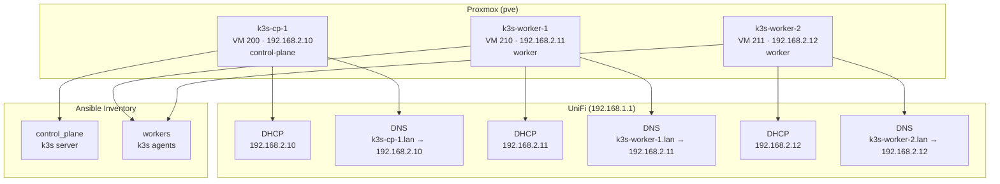

```mermaid
flowchart TD
    subgraph Proxmox["Proxmox (pve)"]
        vm_cp["k3s-cp-1\nVM 200 · 192.168.2.10\ncontrol-plane"]
        vm_w1["k3s-worker-1\nVM 210 · 192.168.2.11\nworker"]
        vm_w2["k3s-worker-2\nVM 211 · 192.168.2.12\nworker"]
    end
    subgraph UniFi["UniFi (192.168.1.1)"]
        dhcp_cp["DHCP\n192.168.2.10"]
        dns_cp["DNS\nk3s-cp-1.lan → 192.168.2.10"]
        dhcp_w1["DHCP\n192.168.2.11"]
        dns_w1["DNS\nk3s-worker-1.lan → 192.168.2.11"]
        dhcp_w2["DHCP\n192.168.2.12"]
        dns_w2["DNS\nk3s-worker-2.lan → 192.168.2.12"]
    end
    subgraph Ansible["Ansible Inventory"]
        ans_cp["control_plane\nk3s server"]
        ans_w["workers\nk3s agents"]
    end
    vm_cp --> dhcp_cp
    vm_cp --> dns_cp
    vm_w1 --> dhcp_w1
    vm_w1 --> dns_w1
    vm_w2 --> dhcp_w2
    vm_w2 --> dns_w2
    vm_cp --> ans_cp
    vm_w1 --> ans_w
    vm_w2 --> ans_w
```
